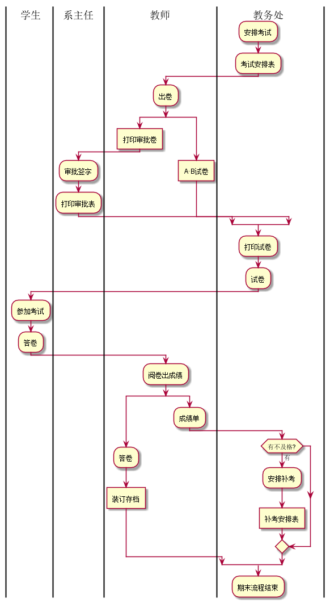
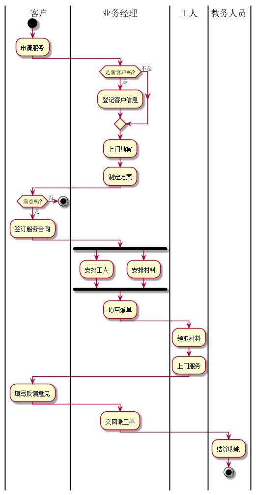

# 实验1：业务流程建模
|学号|班级|姓名|
|:-------:|:-------------: | :----------:|
|201610414316|软件(本)16-3|16.刘柱江|
## 流程图1：考试及成绩管理流程
**PlantUML源码如下：**

``` flow1
@startuml
|学生|
|系主任|
|教师|
|教务处|
:安排考试;
:考试安排表;
|教师|
:出卷;
split
 :打印审批卷]
 |系主任|
 :审批签字;
 :打印审批表;
split again
 |教师|
  :A·B试卷]
  end split
 |教务处|
  :打印试卷;
  :试卷;
|学生|
:参加考试;
:答卷;
|教师|
:阅卷出成绩;
split
:答卷;
:装订存档]
split again
:成绩单;
|教务处|
if (有不及格?) then (有)
:安排补考;
:补考安排表]
endif
end split
:期末流程结束;
@enduml
```

**业务流程图如下：**




**流程说明：**

教务处先安排好考试然后老师出卷并且打印审批
表，审批表通过之后打印试卷安排学生参加考试，
考完试后出成绩得出成绩单，答卷这时可以存档，
成绩单中不合格的人安排补考得出补考安排表，
安排完补考且试卷存档完成
期末流成就结束了。


## 流程图2： 客户维修服务流程

**PlantUML源码如下：**

``` flow2
@startuml
|客户|
start
:申请服务;
|业务经理|
if (是新客户吗?) then (是)
:登记客户信息;
else (不是)
endif
:上门勘察;
:制定方案;
|客户|
if (满意吗?) then (否)
stop
else (是)
:签订服务合同;
|业务经理|
 fork
	:安排工人;
  fork again
	:安排材料;
  end fork
  :填写派单;
|工人|
:领取材料;
:上门服务;
|客户|
:填写反馈意见;
|业务经理|
:交回派工单;
|教务人员|
:结算收账;
stop
@enduml
```
**业务流程图如下：**




**流程说明：**

客户向业务经理申请服务，业务经理看他是不是新客户，是则登记客户。
然后上门勘察，制定方案给客户，客户不满方案结束，满意方案就签订合同。
然后安排工人和材料，填写派工单。工人领取材料上门服务，完成服务工人向客户
填写反馈意见后工人将派工单交给业务经理。最后工人结算收款结束。

