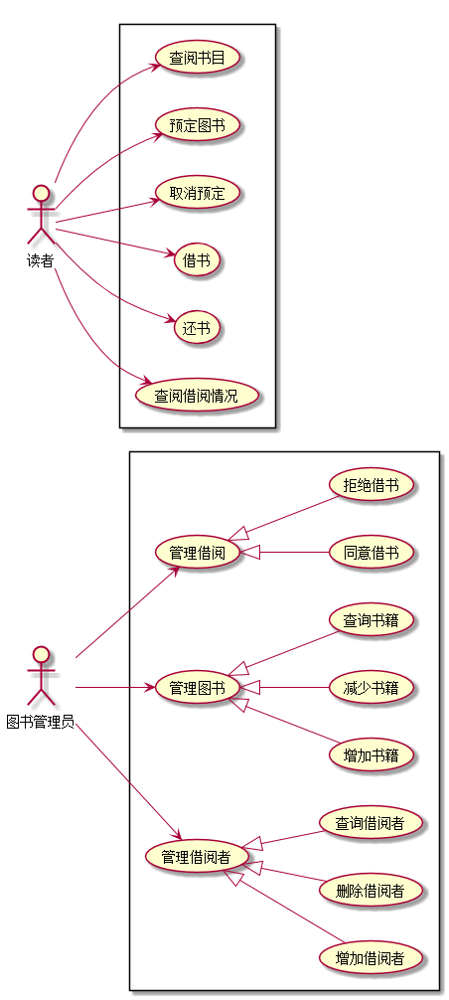

# 实验2：图书管理系统用例建模
|学号|班级|姓名|
|:-------:|:-------------: | :----------:|
|201610414316|软件(本)16-3|16.刘柱江|
## 1. 图书管理系统的用例关系图
#### 1.1 用例图PlantUML源码如下：

``` flow1
@startuml
left to right direction
:图书管理员: as Admin
rectangle {
(管理借阅) as mm
(管理图书) as mb
(管理借阅者) as mr
Admin-->(mm)
Admin-->(mb)
Admin-->(mr)
mm<|--(同意借书)
mm<|--(拒绝借书)
mb<|--(增加书籍)
mb<|--(减少书籍)
mb<|--(查询书籍)
mr<|--(增加借阅者)
mr<|--(删除借阅者)
mr<|--(查询借阅者)
}

actor 读者  as user
rectangle {
user-->(查阅书目)
user-->(预定图书)
user-->(取消预定)
user-->(借书)
user-->(还书)
user-->(查阅借阅情况)
}
@enduml
```

#### 1.2. 用例图如下：


###### ------------------------------------------------------------------------------------------

## 2. 参与者说明：

#### 2.1 图书管理员

主要职责是：管理读者用户信息，管理书籍信息，审核借阅信息

#### 2.2 读者

主要职责是：订阅书籍，查寻书籍和借阅情况，查看书籍订阅情况

###### ------------------------------------------------------------------------------------------

## 3. 用例规约表

#### 3.1 “借出图书”用例

    <table>
        <tr>
            <th>设备</th>
            <th>设备文件名</th>
            <th>文件描述符</th>
            <th>类型</th>
        </tr>
        <tr>
            <th>键盘</th>
            <th>/dev/stdin</th>
            <th>0</th>
            <th>标准输入</th>
        </tr>
        <tr>
            <th>显示器</th>
            <th>/dev/stdout</th>
            <th>1</th>
            <th>标准输出</th>
        </tr>
        <tr>
            <th>显示器</th>
            <th>/dev/stderr</th>
            <th>2</th>
            <th>标准错误输出</th>
        </tr>
    </table>

#### 3.2 “购入图书”用例

参见：表7.5
“购入图书”用例流程图源码如下：


#### 3.3 “***”用例
参见：表7.5