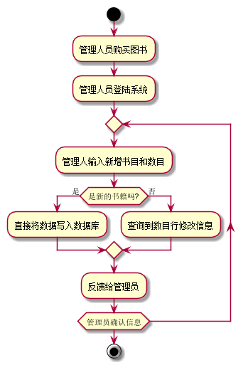

# 实验2：图书管理系统用例建模
|学号|班级|姓名|
|:-------:|:-------------: | :----------:|
|201610414316|软件(本)16-3|16.刘柱江|
## 1. 图书管理系统的用例关系图
#### 1.1 用例图PlantUML源码如下：

``` flow1
@startuml
left to right direction
:图书管理员: as Admin
rectangle {
(管理借阅) as mm
(管理图书) as mb
(管理借阅者) as mr
Admin-->(mm)
Admin-->(mb)
Admin-->(mr)
mm<|--(同意借书)
mm<|--(拒绝借书)
mb<|--(增加书籍)
mb<|--(减少书籍)
mb<|--(查询书籍)
mr<|--(增加借阅者)
mr<|--(删除借阅者)
mr<|--(查询借阅者)
}

actor 读者  as user
rectangle {
user-->(查阅书目)
user-->(预定图书)
user-->(取消预定)
user-->(借书)
user-->(还书)
user-->(查阅借阅情况)
}
@enduml
```

#### 1.2. 用例图如下：


###### ------------------------------------------------------------------------------------------

## 2. 参与者说明：

#### 2.1 图书管理员

主要职责是：管理读者用户信息，管理书籍信息，审核借阅信息

#### 2.2 读者

主要职责是：订阅书籍，查寻书籍和借阅情况，查看书籍订阅情况

###### ------------------------------------------------------------------------------------------

## 3. 用例规约表

#### 3.1 “借出图书”用例

|-----|------|
|:--------|:------|
|用例名称|借出图书|
|参与者|图书管理员，读者|
|前置条件|图书充足，系统权限足够|
|后置条件|借出图书成功|
|     |      |
|  主流事件  |    |
| 参与者动作 |系统行为|
|           |1.列出可借阅的图书|
|2.读者选择想借阅的图书|     |
|           |3.将借阅请求交给图书馆员|
|4.图书管理员同意借书申请|     |
|           |3.修改数据库信息，读者借书成功|
|           |             |
| 备选流事件 |4a.管理员不同意借书。  <br>  1.反馈读者不同意借书，结束失败|
| 业务规则 |1.不允许借阅的书不会显示  <br>  2.数据库正常都会修改成功  |    3.读者提交了借书信息管理员一定会处理|

#### 3.2 “增加图书”用例

|-----|------|
|:--------|:------|
|用例名称|增加图书|
|参与者|图书管理员|
|前置条件|系统权限足够|
|后置条件|图书会正确加入书库|
|     |      |
|  主流事件  |    |
| 参与者动作 |系统行为|
|1.管理员输入图书名和书量用来增加图书 |       |
|           |2.数据库增加书籍|
|           |3.反馈增加书籍成功  |
|4.图书管理员确认图书状态|     |
|           |             |
| 备选流事件 |2a.原本没有书籍。<br>    1.添加书名和数量到数据库  <br> 4a.管理员确认信息出错 <br>  1.删除信息，重新进入第一步 |
| 业务规则 |1.有足够的容量容纳图书   2.数据库正常都会修改成功 |    |


#### 3.3 “预定图书”用例
|-----|------|
|:--------|:------|
|用例名称|预定图书|
|参与者|读者|
|前置条件|系统权限足够|
|后置条件|书籍被预定不能再借阅给其他人|
|     |      |
|  主流事件  |    |
| 参与者动作 |系统行为|
|1.读者输入图书名来查阅图书 |       |
|              |2.数据库反馈数据|
|3.读者预定图书 |     |
|              |3.反馈预定书籍成功  |
|4.读者管理员确认图书状态|     |
|           |             |
| 备选流事件 |2a.原本没有书籍。 <br>   1.书籍不会被显示  <br> 4a.管理员确认信息出错  <br> 1.删除信息，重新进入第一步 |
| 业务规则 |1数据库正常都会修改成功   |