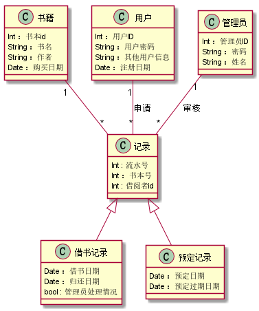
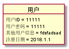
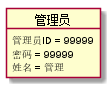
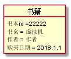
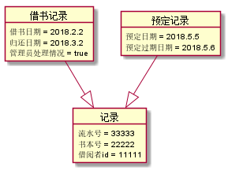

# 实验3：图书管理系统领域对象建模
|学号|班级|姓名|
|:-------:|:-------------: | :----------:|
|201610414316|软件(本)16-3|刘柱江|

## 1. 图书管理系统的类图

### 1.1 类图PlantUML源码如下：

``` class
         @startuml
         class 书籍 {
           Int ：书本id
           String ：书名
           String ：作者
           Date ：购买日期
         }
         class 借书记录 {
           Date ：借书日期
           Date ：归还日期
           bool : 管理员处理情况
         }
         class 用户 {
           Int ：用户ID
           String ：用户密码
           String ：其他用户信息
           Date ：注册日期
         }
         class 记录{
             Int : 流水号
             Int ：书本号
             Int : 借阅者id
         }
         class 预定记录 {
             Date ：预定日期
             Date ：预定过期日期
         }
         class 管理员 {
           Int ：管理员ID
           String ：密码
           String ：姓名
         }
         记录<|--预定记录
         记录<|--借书记录
         管理员"1"--"*"记录 :审核
         用户"1"--"*"记录 :申请
         书籍"1"--"*"记录
         @enduml
```

### 1.2. 类图如下：

参见图8.17



### 1.3. 类图说明：
```
1.分为用户，管理员，书籍，记录四个类，记录有借书记录和预定记录两个子类。
2.一个用户可以申请多个记录，所以用户和记录是1对多关系。
3.用户申请了记录之后会给管理员审核，一个管理员可以审核多条记录，所以管理员和记录1对多关系。
4.一本书可以被多次用户多次申请，生成不同时期的记录，所以书籍和记录是一对多关系。
5.用户和管理员类没有直接对应关系。书籍和用户没有直接对应关系。
```
## 2. 图书管理系统的对象图
### 2.1 类用户的对象图
#### 源码如下：
``` class
@startuml
object 用户 {
  用户ID = 11111
  用户密码 = 11111
  其他用户信息 = fdsfadsad
  注册日期 = 2018.1.1
}
@enduml
``` 
#### 类对象图如下：


### 2.2 类管理员的对象图
#### 源码如下：
``` class
@startuml
object 管理员 {
  管理员ID = 99999
  密码 = 99999
  姓名 = 管理
}
@enduml
``` 
#### 对象图如下：


### 2.3 类书籍的对象图
#### 源码如下：
``` class
object 书籍 {
 书本id =22222
 书名 = 虚拟机
 作者 = 作者
 购买日期 = 2018.1.1
}
@enduml
```
#### 对象图如下：

### 2.4 类记录的对象图
#### 源码如下：
``` class
@startuml
object 借书记录 {
  借书日期 = 2018.2.2
  归还日期 = 2018.3.2
  管理员处理情况 = true
}
object 记录{
   流水号 = 33333
   书本号 = 22222
   借阅者id = 11111
}
object 预定记录 {
    预定日期 = 2018.5.5
    预定过期日期 = 2018.5.6
}
借书记录--|>记录
预定记录--|>记录
@enduml
```
#### 对象图如下：

