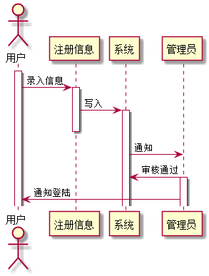

# 实验4：图书管理系统顺序图绘制
|学号|班级|姓名|
|:-------:|:-------------: | :----------:|
|201610414316|软件(本)16-3|刘柱江|

## 图书管理系统的顺序图

## 1. 借书用例
## 1.1. 借书用例PlantUML源码

``` sequence
@startuml
actor 读者
activate 读者
读者 ->藏书书库 :查询可借阅书籍
activate 藏书书库
藏书书库 ->读者 :返回查询结果
读者 -> 管理员 :申请借阅书籍
activate 管理员
管理员 -> 借书记录 :审核信息查看往期记录
activate 借书记录
借书记录 ->管理员 :返回信息
管理员 -> 借书记录 :审核通过同意借书
借书记录 ->读者 :借书成功
借书记录 ->管理员 :借书成功
管理员 -> 藏书书库 :减少书籍
deactivate 管理员
deactivate 借书记录
deactivate 读者
deactivate 藏书书库
@enduml
```

## 1.2. 借书用例顺序图


## 1.3. 借书用例顺序图说明
读者先查询书库中的可借书目，然后提出借书申请，
管理员对用户的记录进行查看，如果可信则同意此次借书，写入记录，修改书库信息，同时通知用户借书成功。

***

## 2. 还书用例
## 2.1. 还书用例PlantUML源码

``` sequence

@startuml
actor 读者
activate 读者
读者 ->借书记录 :查询自己已经借的书
activate 借书记录
借书记录 ->读者 :返回查询结果
deactivate 借书记录
读者 -> 管理员 :申请归还书籍
activate 管理员
管理员 -> 书库 :审核信息并归还
activate 书库
书库 ->管理员 : 归还成功
书库 ->读者 : 归还成功
deactivate 书库
deactivate 管理员
deactivate 读者
@enduml

```

## 2.2. 还书用例顺序图


## 2.3. 还书用例顺序图说明
读者查询自己的借书记录，然后选择要归还的图书，管理员确认了归还修改书库信息，通知读者归还成功
***

## 3. 增加书籍用例
## 2.1. 增加书籍用例PlantUML源码
``` sequence
@startuml
activate 管理员
activate 系统
actor 管理员
管理员 ->系统 :登陆
管理员 -> 书籍信息 :录入
activate 书籍信息
书籍信息 ->书库 :加入
deactivate 书籍信息
activate 书库
书库 ->管理员 :书籍加入成功
@enduml
``` 
## 3.2. 增加书籍用例顺序图


## 3.3. 增加书籍用例顺序图说明
管理员登陆系统，录入书籍信息，然后写入书库，写入成功后通知管理员
***

## 4. 增加借阅者书籍用例
## 2.1. 增加借阅者用例PlantUML源码
``` sequence
@startuml
actor 用户
activate 用户
用户 -> 注册信息 :录入信息
activate 注册信息
注册信息 -> 系统 :写入
deactivate 注册信息
系统 -> 管理员 :通知
activate 系统
管理员 -> 系统 :审核通过
activate 管理员
管理员 -> 用户 :通知登陆
@enduml
``` 
## 4.2. 增加借阅者用例顺序图


## 4.3. 增加借阅者用例顺序图说明
用户进入注册信息，注册信息被系统通知给管理员，管理员审核后将用户信息写入系统，同时通知用户注册成功
***