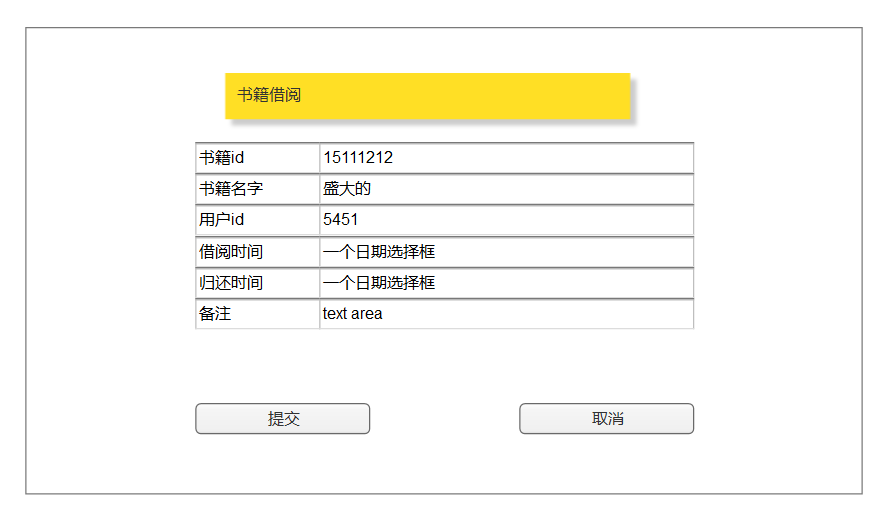

# 实验5：图书管理系统数据库设计与界面设计（老师示范）
|学号|班级|姓名|
|:-------:|:-------------: | :----------:|
|201610414316|软件(本)16-3|刘柱江|

## 1.数据库表设计

## 1.1. 书籍表
|字段|类型|主键，外键|可以为空|默认值|约束|说明|
|:-------:|:-------------:|:------:|:----:|:---:|:----:|:-----|
|ID|varchar2(100)|主键|否||||
|Name|varchar2(100)| |否||||
|Author|varchar2(100)| |否||||
|Date|Date| |是| | |录入日期|
## 1.2. 预定-借书记录表
|字段|类型|主键，外键|可以为空|默认值|约束|说明|
|:-------:|:-------------:|:------:|:----:|:---:|:----:|:-----|
|ID|varchar2(100)|主键|否||||
|user_ID|varchar2(100)|外键|否| | 用户表id| |
|book_ID|varchar2(100)|外键|否| | 书籍表id | |
|Date_start|Date| |否|||借书日期|
|Date_end|Date| |否|||归还日期|
|state | varchar2(100)| |是| | |管理员处理情况|
|pre_Date_start|Date| |是| | | 预定日期|
|pre_Date_end|Date| | 是| | | 预定过期日期|
## 1.3. 用户表
|字段|类型|主键，外键|可以为空|默认值|约束|说明|
|:-------:|:-------------:|:------:|:----:|:---:|:----:|:-----|
|ID|varchar2(100)|主键|否||||
|Name|varchar2(100)| |否||||
|password|varchar2(100)| |否||||
|Date|Date| |是| | |注册日期|
## 1.4. 管理员表
|字段|类型|主键，外键|可以为空|默认值|约束|说明|
|:-------:|:-------------:|:------:|:----:|:---:|:----:|:-----|
|ID|varchar2(100)|主键|否||||
|Name|varchar2(100)| |否||||
|password|varchar2(100)| |否||||
***

## 2. 界面设计
## 2.1. 借书界面设计

- 用例图参见：借书用例
- 类图参见：借书类，读者类
- 顺序图参见：借书顺序图
- API接口如下：

1. 借书

- 功能：用于借书
- 请求地址： https://github.com/1771190842/is_analysis/blob/master/uri/home.html
- 请求方法：POST ,put
- 请求参数：

|参数名称|必填|说明|
|:-------:|:-------------: | :----------:|
|access_token|是|用于验证请求合法性的认证信息。 |
|method|是|get或post|

- 返回实例：
```
{
    "info": "感谢您的支持。",
    "data": {
        "ID": "682626"
        "book_id": "645612656",
        "name": "盛大的"
        "user_id": "14361",
        "Date_start": "1997-10-10",
        "Date_end": "1997-10-20",
        "avatar128": "http://upload.opensns.cn/Uploads_Avatar_14361_58e4b58fccf81.jpg?imageMogr2/crop/!260x260a6a22/thumbnail/128x128!",
        "avatar512": "http://upload.opensns.cn/Uploads_Avatar_14361_58e4b58fccf81.jpg?imageMogr2/crop/!260x260a6a22/thumbnail/512x512!"
    },
    "code": 200
}
```
- 返回参数说明：
  
  
 2.借书信息   
  
  - 功能：借书信息  
  - 请求地址： https://github.com/1771190842/is_analysis/blob/master/uri/home.html
  - 请求方法：POST ,put
  - 请求参数：  
 
    
|参数名称|说明|
|:-------:|:-------------: |
|Info|返回信息|
|data|书籍借阅信息|
|code|返回码|1. 借书
          
          - 功能：用于借书
          - 请求地址： https://github.com/1771190842/is_analysis/blob/master/uri/home.html
          - 请求方法：POST ,put
          - 请求参数：
          
          |参数名称|必填|说明|
          |:-------:|:-------------: | :----------:|
          |access_token|是|用于验证请求合法性的认证信息。 |
          |method|是|get或post|
          
          - 返回实例：
          ```
          {
              "info": "感谢您的支持。",
              "data": {
                  "ID": "682626"
                  "book_id": "645612656",
                  "name": "盛大的"
                  "user_id": "14361",
                  "Date_start": "1997-10-10",
                  "Date_end": "1997-10-20",
                  "avatar128": "http://upload.opensns.cn/Uploads_Avatar_14361_58e4b58fccf81.jpg?imageMogr2/crop/!260x260a6a22/thumbnail/128x128!",
                  "avatar512": "http://upload.opensns.cn/Uploads_Avatar_14361_58e4b58fccf81.jpg?imageMogr2/crop/!260x260a6a22/thumbnail/512x512!"
              },
              "code": 200
          }
          ```
          - 返回参数说明：
              
          |参数名称|说明|
          |:-------:|:-------------: |
          |Info|返回信息|
          |data|书籍借阅信息|
          |code|返回码|

