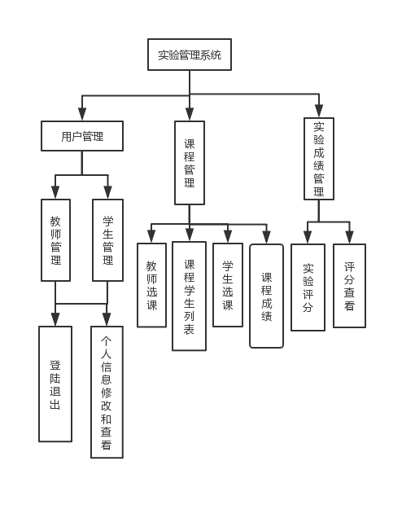
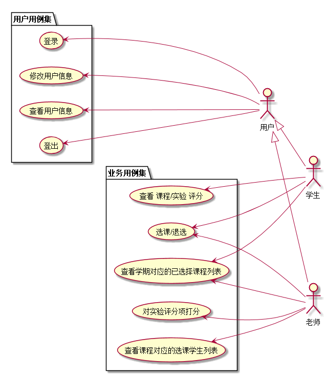
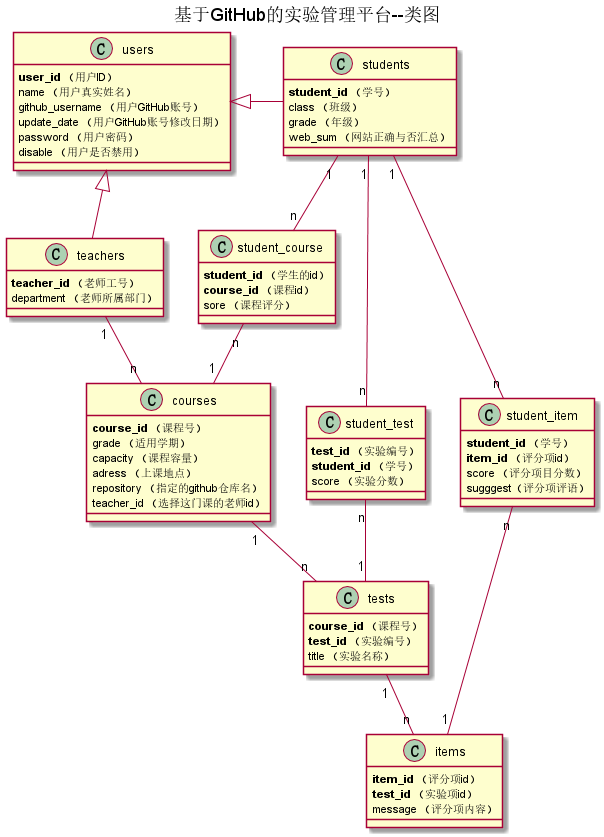

<!-- markdownlint-disable MD033-->
<!-- 禁止MD033类型的警告 https://www.npmjs.com/package/markdownlint -->

# 基于GitHub的实验管理平台的分析与设计

### 成都大学信息科学与工程学院

|学号|班级|姓名|
|:-------:|:-------------: | :----------:|
|201610414316|软件(本)16-3|刘柱江|

## 1. 概述
- 基于GitHub的实验管理平台的作用是在线管理实验成绩的Web应用系统。学生和老师的实验内容均存放在GitHUB
页面上。
- 学生的功能主要有：选择课程，设置自己的GitHub用户名，查询自己的每个课程的实验成绩。学生的GitHub用户名是公开的，但成绩不公开。
- 老师的功能主要有：选择课程，进入课程批改每个学生的成绩，进入课程查看每个学生的成绩。
- 老师和学生都能通过本系统的链接方便地跳转到学生的每个GitHUB实验目录，以便批改实验或者查看实验情况。
- 实验成绩按数字分数计算，每项实验的满分为100分，最低为0分。
- 系统自动计算每个学生的每个课程所有实验的平均分。
- 一个老师选择上多门课，每个老师只能维护老师自己的课程及成绩。
- 一人同学选择上多门课，每个同学只能查询同学自己的课程的实验成绩。
- 老师和同学都可以选多门课程，但必须是老师先选，学生后选。
- 有多个学期，每个学期都有不同的实验。
- 每个实验的实验成绩细分为多个评分项，每个评分项对应各自的评分标准。 老师在批改实验的时候，对每个评分项进行评分并输入对应的文字评价，系统自动计算出所有评分项的成绩之和为该实验的总成绩。
- 总的来说，有多个学期，每个学期有多个课程，每个课程多个实验，每个实验有多个评分项目。
    
   
## 2. 系统总体结构

界面设计参见：https://zwdbox.github.io/is_analysis/test6/ui/index.html
    
## 3. 用例图设计 [源码](src/系统用例.puml)

## 4. 类图设计 [源码](src/类图.puml)

## 5. 数据库设计
- ### [参见数据库设计](./数据库设计.md)

## 6. 用例及界面详细设计
- ### [“界面集合”](https://1771190842.github.io/is_analysis_pages/test6/ui/#g=1&p=home)
- ### [“课程的学生列表”用例](./用例/课程学生列表.md),[界面](https://1771190842.github.io/is_analysis_pages/test6/ui/course-students)
- ### [“评定成绩”用例](./用例/成绩评分.md),[界面](https://1771190842.github.io/is_analysis_pages/test6/ui/test.html)
- ### [“查看成绩”用例](./用例/查看成绩.md),[界面](https://1771190842.github.io/is_analysis_pages/test6/ui/test.html)
- ### [“修改用户信息”用例](./用例/修改用户信息.md),[界面](https://1771190842.github.io/is_analysis_pages/test6/ui/change-message.html)
- ### [“查看用户信息”用例](./用例/查看用户信息.md),[界面](https://1771190842.github.io/is_analysis_pages/test6/ui/self-message.html)
- ### [“登出”用例](./用例/登出.md),[界面](https://1771190842.github.io/is_analysis_pages/test6/ui/top.html)
- ### [“登录”用例](./用例/登录.md),[界面](https://1771190842.github.io/is_analysis_pages/test6/ui/top.html)
- ### [“选课”用例](./用例/选课.md),[界面](https://1771190842.github.io/is_analysis_pages/test6/ui/courses-list)
- ### [“退课”用例](./用例/退选.md),[界面](https://1771190842.github.io/is_analysis_pages/test6/ui/courses-list)
