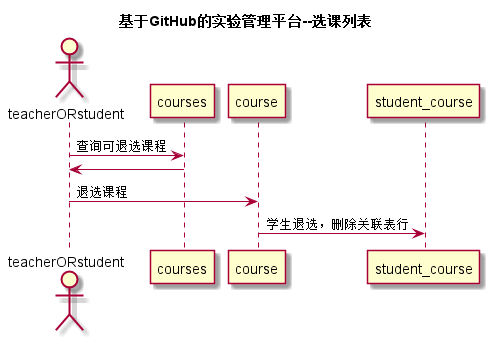

<!-- markdownlint-disable MD033-->
<!-- 禁止MD033类型的警告 https://www.npmjs.com/package/markdownlint -->

# “选课”用例 [返回](../README.md)
## 1. 用例规约

|用例名称|退选|
|-------|:-------------|
|功能|退选指定课程|
|参与者|老师，学生|
|前置条件|老师，学生需要先登录|
|后置条件| |
|主事件流|见业务流程图 |
|备选事件流| |

## 2. 业务流程（顺序图） [源码](../src/退选.puml)
 

## 3. 界面设计
- 界面参照: https://zwdbox.github.io/is_analysis/test6/ui/index.html
- API接口调用
    - 接口1：[getcourse](../接口/getcourse.md) 
    - 接口2：[choosecourse](../接口/choosecourse.md) 
    - 接口3：[unchoosecourse](../接口/unchoosecourse.md) 

## 4. 算法描述
无
    
## 5. 参照表

- [STUDENTS](../数据库设计.md/#STUDENTS)
- [courses](../数据库设计.md/#courses)
- [teacher](../数据库设计.md/#teacher)
- [student_course](../数据库设计.md/#student_course)

